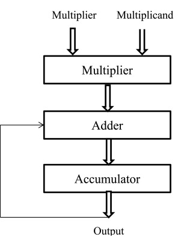
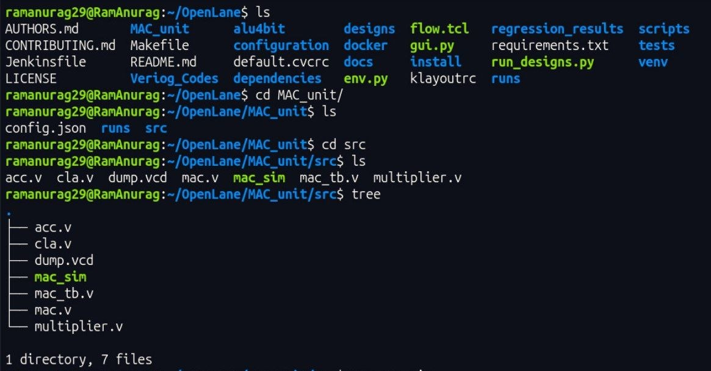
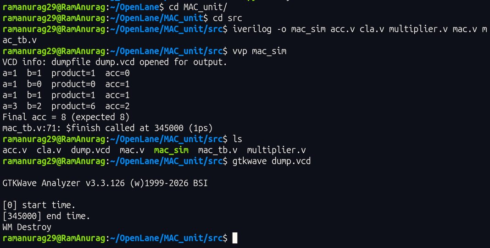
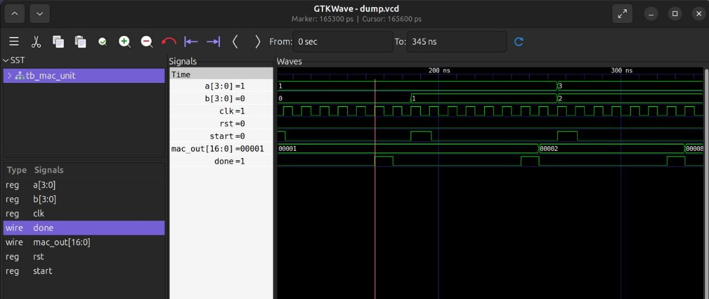

<h1 align="center">
MAC Unit RTL to GDSII
</h1>

A Multiply–Accumulate (MAC) unit is adigital  hardware block, essential to (DSPs) and computers, that computes the sum of products of two numbers (DSP) in a single clock cycle. 

It increases speed for algorithms requiring frequent multiplication and addition, such as convolutional neural networks , digital filtering, and Fast Fourier Transforms.

Here I have demosntrated the ASIC implementation ***RTL to GDSII*** roadmap to implement your own MAC unit. 

After working on Ubuntu, Cadence and Azure I would suggest to work on all to get better persepctive towards RTL designing some offfer smooth GUI but complex terminal while other offers smooth terminal cmd but no GUI :) . 

The objective of this project is to demonstrate the complete digital IC design methodology, including RTL development, functional verification, synthesis, physical implementation, timing analysis, and layout generation.

The general steps towards design are merely same just commands on terminal vary a little. 

  
   
  <b>MAC Unit Architecture</b>

This project is carried out on two different platforms i.e Ubuntu OpenLane and Azure OpenLane in Powershell. 

Commands are almost similar to use but a core format to follow is provided below. 

Go to the OpenLane Folder and follow these commands. 

Step 1 : Create a directory : **mkdir MAC_unit**

Step 2 : Go to that directory : **cd MAC_unit**

You can also check any folder if created using command **ls** to see available files in particular directory. 

Step 3 : Create a new directory named src and do all codes here : **mkdir src**

Here you have to create your cla.v, multiplier.v, acc.v, mac.v & mac_tb.v using gedit command. 

Step 4 : Create cla.v : **gedit cla.v**

Here a new window will appear and put the respective cla adder code here and then save it, close the window and you will return to terminal again. 

Type **ls** and enter you will see a new file **cla.v** there. 

Step 5 : Repeate this process for rest files each time type **gedit "filename"** and window will appear put the codes. 

After all 5 files again hit ls and you will see all 5 files there. 

Note these 5 files should be under src.

Step 6 : Change directory and go back to MAC_unit : **cd ..**

After that command now you are in MAC_unit directory again here create config.json and put its code. 

Step 7 : Create config.json : **gedit config.json**

Put the respective config code provided.

So a generic view till here would be as provided. 

  
   
  <b>Terminal View</b>

The **runs, dump_vcd, mac_sim** will be created automatically for simulation and gtkwave analysis. 

Step 8 : Do the simulation part , continuing to work in src directory and type these two commands in terminal. : 

**iverilog -o mac_sim acc.v cla.v multiplier.v mac.v mac_tb.v**

**vvp_sim**

Then you will get the simulation results

  
   
  <b>Terminal SImulation</b>

Step 9 : Now for Gtkwave : **gtkwave dump.vcd**

The gtkwave will appear select ***tb_mac_unit*** on top left and select the required signals from waveform and adjust the maginfier to trace waveforms properly. 

  
   
  <b>Gtkwave View</b>

