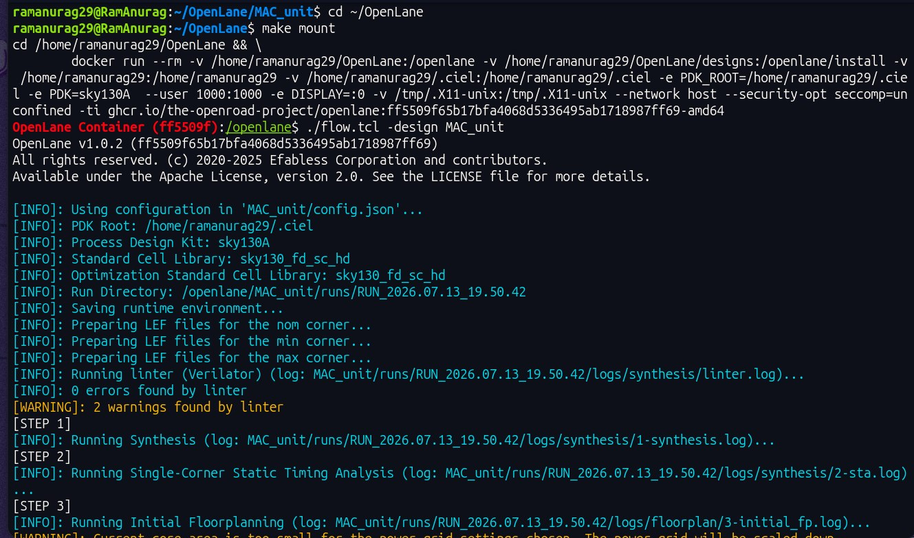
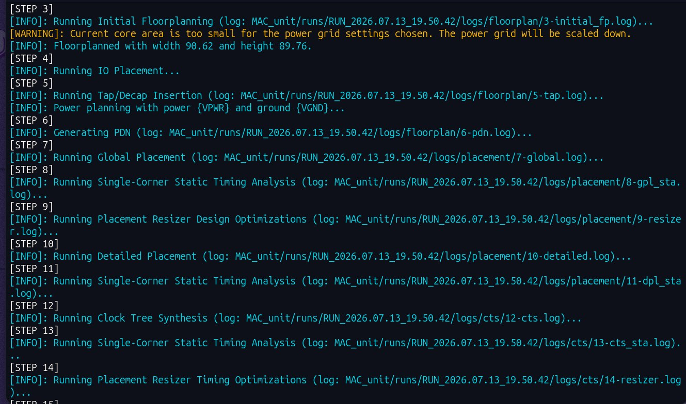
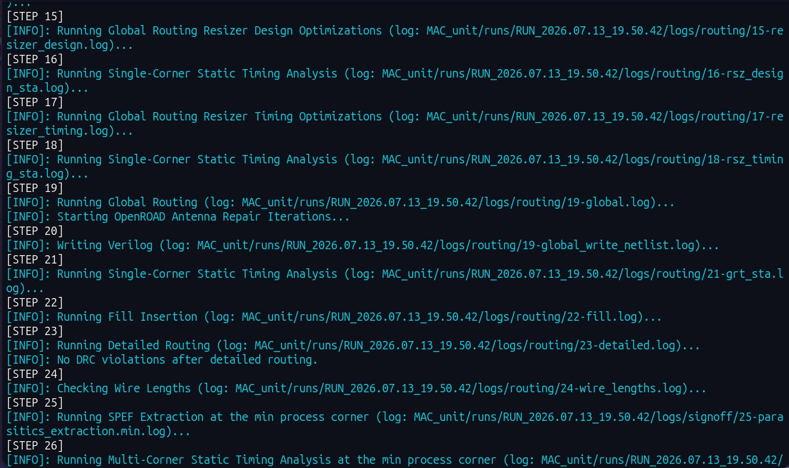
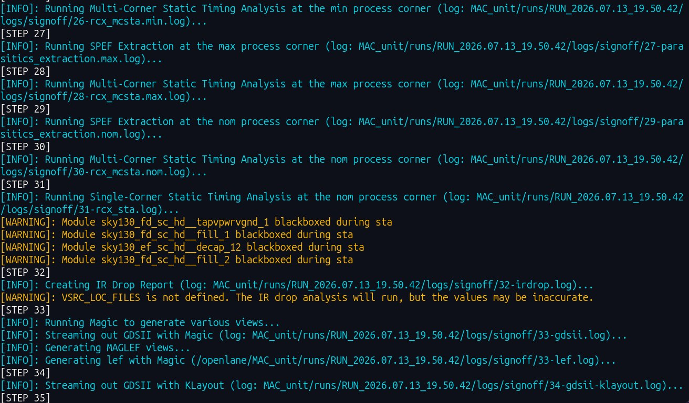
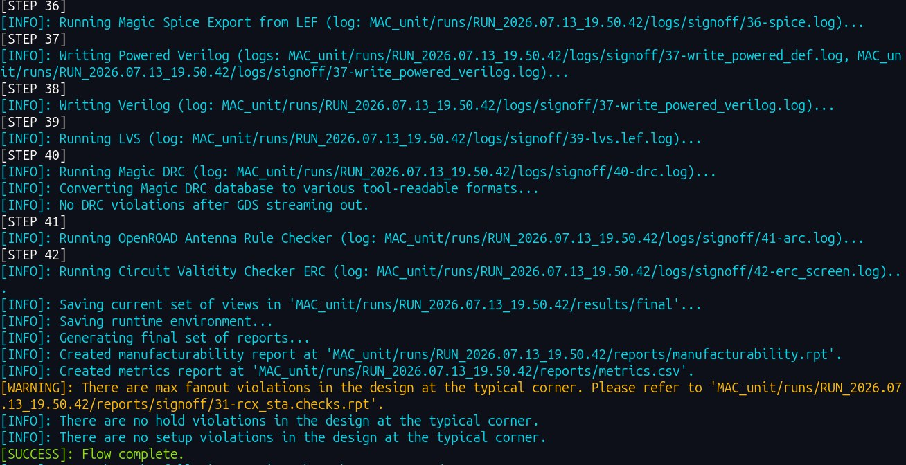
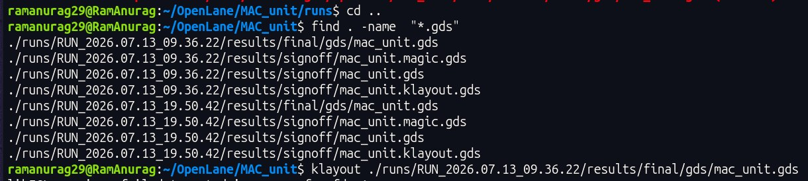
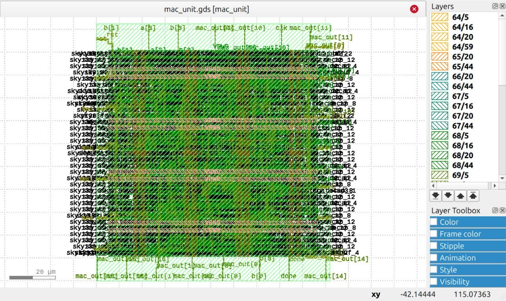
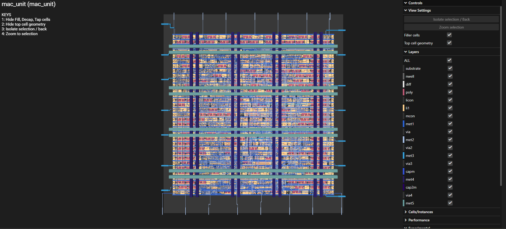

<h1 align="center"> MAC Unit RTL → GDSII</h1>

<p align="center">
<b>Complete ASIC Implementation using Verilog HDL, OpenLane & Sky130 PDK</b>
</p>

<p align="center">


</p>

---

# Overview

A **Multiply–Accumulate (MAC)** unit is a digital hardware block widely used in **Digital Signal Processing (DSP)** and computer architectures. 

This repository demonstrates the complete **RTL → GDSII** ASIC implementation flow of a custom **4-bit MAC Unit** using **Ubuntu**, **OpenLane**, and the **Sky130 Process Design Kit (PDK)**.

The overall ASIC implementation flow remains the same across platforms (Ubuntu, Azure VM, etc.); only the installation and terminal commands vary slightly.

---

# MAC Unit Architecture

<p align="center">

</p>

<p align="center">
<b>Figure 1.</b> MAC Unit Block Diagram
</p>

---

# Project Setup

Navigate to the **OpenLane** directory and follow the steps below.

<table>

<tr>
<th width="15%">Step</th>
<th>Description</th>
</tr>

<tr>
<td><b>Step 1</b></td>
<td>

Create a new project directory.

<pre><code>mkdir MAC_unit</code></pre>

</td>
</tr>

<tr>
<td><b>Step 2</b></td>
<td>

Move into the project directory.

<pre><code>cd MAC_unit</code></pre>

</td>
</tr>

<tr>
<td><b>Step 3</b></td>
<td>

Create the <code>src</code> directory.

<pre><code>mkdir src</code></pre>

</td>
</tr>

<tr>
<td><b>Step 4</b></td>
<td>

Move into the source directory and create the CLA module.

<pre><code>cd src
gedit cla.v</code></pre>

Paste the CLA Verilog code, save the file, and close the editor.

</td>
</tr>

<tr>
<td><b>Step 5</b></td>
<td>

Repeat the same process for:

<ul>

<li><code>multiplier.v</code></li>

<li><code>acc.v</code></li>

<li><code>mac.v</code></li>

<li><code>mac_tb.v</code></li>

</ul>

After creating each file, verify using

<pre><code>ls</code></pre>

</td>
</tr>

<tr>
<td><b>Step 6</b></td>
<td>

Return to the project directory.

<pre><code>cd ..</code></pre>

</td>
</tr>

<tr>
<td><b>Step 7</b></td>
<td>

Create the OpenLane configuration file.

<pre><code>gedit config.json</code></pre>

Paste the configuration code and save it.

</td>
</tr>

</table>

<td>

</td>
---

# RTL Simulation

Move into the **src** directory and compile the design.

```bash
iverilog -o mac_sim acc.v cla.v multiplier.v mac.v mac_tb.v
```

Run the simulation.

```bash
vvp mac_sim
```

After successful execution, the terminal should display the simulation output.

<p align="center">

</p>

<p align="center">
<b>Figure 3.</b> RTL Simulation Output
</p>

---

# GTKWave Verification

Open the waveform.

```bash
gtkwave dump.vcd
```

Inside GTKWave:

- Select **tb_mac_unit**
- Add the required signals
- Adjust the zoom level to inspect the waveform

<p align="center">

</p>

<p align="center">
<b>Figure 4.</b> GTKWave Verification
</p>

---

# RTL → GDSII Flow

Return to the **OpenLane** directory.

```bash
cd ~/OpenLane
```

Launch the Docker container.

```bash
make mount
```

Run the complete OpenLane flow.

```bash
./flow.tcl -design MAC_unit
```

OpenLane will automatically perform:

- RTL Elaboration
- Logic Synthesis
- Floorplanning
- Placement
- Clock Tree Synthesis
- Routing
- DRC
- LVS
- GDSII Generation

<table>

<tr>

<td>

</td>

<td>

</td>

</tr>

<tr>

<td>

</td>

<td>

</td>

</tr>

<tr>

<td colspan="2" align="center">

</td>

</tr>

</table>

> Ignore minor warnings if present. The important message is:

```text
SUCCESS : Flow Complete
```

---

# KLayout Visualization

Locate the generated GDSII file.

```bash
find . -name "*.gds"
```

Open the generated layout.

```bash
klayout <path_to_gds_file>
```

<p align="center">

</p>

<p align="center">
<b>Figure 5.</b> Generated GDSII File
</p>

<p align="center">

</p>

<p align="center">
<b>Figure 6.</b> KLayout View
</p>

---

# 3D GDS Visualization

Copy the generated **.gds** file and upload it to

**Tiny Tapeout GDS Viewer**

https://gds-viewer.tinytapeout.com/

<p align="center">

</p>

<p align="center">
<b>Figure 7.</b> 3D Visualization of the Final GDSII Layout
</p>

---

# Source Files

The project consists of the following Verilog modules.

| File | Description |
|------|-------------|
| `multiplier.v` | Sequential Shift-and-Add Multiplier |
| `cla.v` | 17-bit Carry Lookahead Adder |
| `acc.v` | 17-bit Accumulator |
| `mac.v` | Top-level MAC Module |
| `mac_tb.v` | Functional Testbench |
| `config.json` | OpenLane Configuration |

---

# Conclusion

The complete **RTL → GDSII** implementation of the **MAC Unit** has been successfully demonstrated.

This design can be further extended into:

- ✅ Multi-MAC Arrays
- ✅ Pipelined Architectures
- ✅ Systolic Arrays
- ✅ Matrix Multiplication Engines
- ✅ CNN / AI Accelerators
- ✅ FPGA Implementations

---
